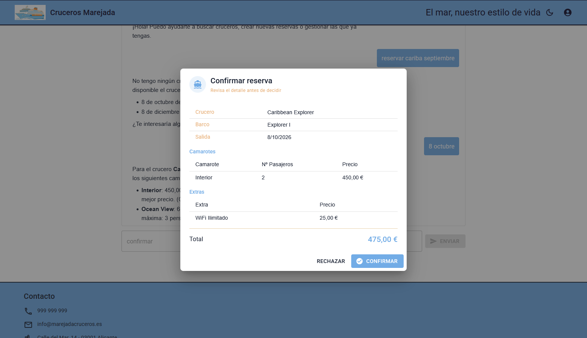
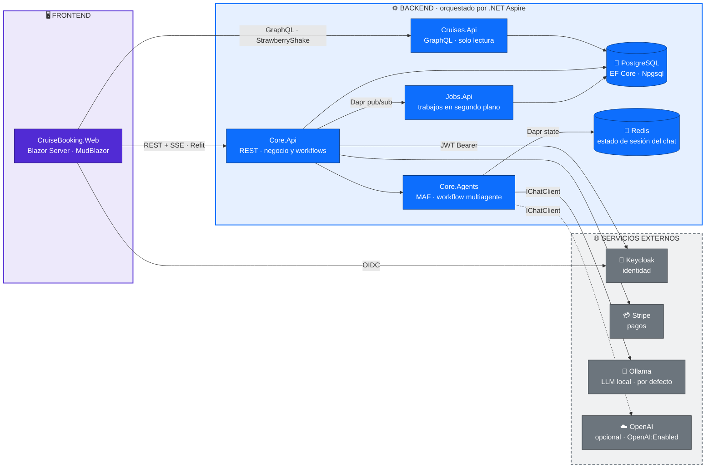
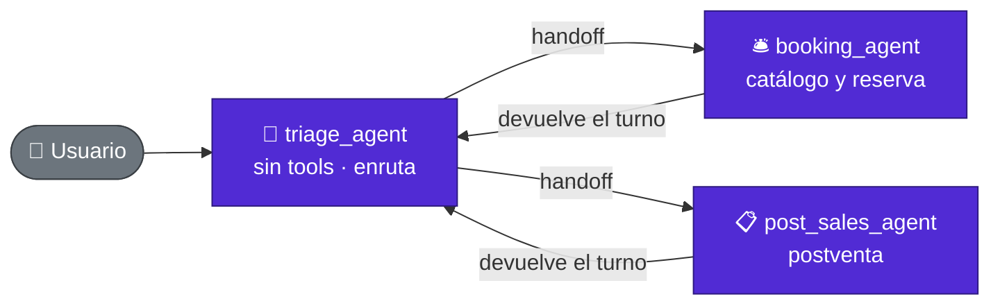
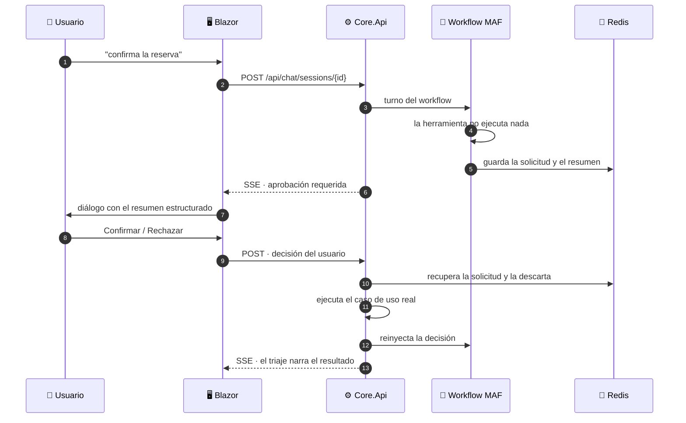

# 🚢 CruiseBooking

[](https://dotnet.microsoft.com/)
[](https://learn.microsoft.com/dotnet/csharp/)
[](https://dotnet.microsoft.com/apps/aspnet/web-apps/blazor)
[](https://learn.microsoft.com/dotnet/aspire/)
[](https://www.postgresql.org/)
[](https://dapr.io/)
[](https://www.rabbitmq.com/)
[](https://chillicream.com/docs/hotchocolate)
[](https://www.keycloak.org/)
[](https://stripe.com/)
[](https://ollama.com/)
[](https://github.com/microsoft/agent-framework)
[](https://platform.openai.com/)

Plataforma de reserva de cruceros construida de extremo a extremo sobre **.NET 10**: backend distribuido, frontend Blazor Server y orquestación con .NET Aspire. Se trata de un proyecto de aprendizaje creado manualmente, usando la IA como apoyo para dudas o tareas repetitivas.

El proyecto incluye búsqueda de cruceros, reserva de camarotes y extras, cálculo de impuestos y cobro con Stripe, facturación en PDF por correo, check-in de pasajeros y un asistente de IA multiagente construido sobre **Microsoft Agent Framework**, con *handoff* entre agentes especializados y aprobación manual de las acciones sensibles. Por debajo: Clean Architecture en tres hosts acotados, CQRS a nivel de transporte (lecturas por GraphQL, escrituras por REST), mediador propio sin MediatR, workflows con Dapr y background jobs con Dapr.

---

## 📸 Capturas

| Portada | Búsqueda de cruceros |
| :---: | :---: |
|  |  |
| **Selección de camarotes** | **Resumen y pago** |
|  |  |
| **Check-in · resumen** | **Check-in · datos del pasajero** |
|  |  |
| **Mis reservas** | **Asistente IA** |
|  |  |
| **Asistente IA · aprobación de herramienta** | |
|  | |

---

## 🏗 Arquitectura

### Vista general



### Trabajo en segundo plano con Dapr

Cada host lleva su propio *sidecar* de Dapr; toda la comunicación asíncrona pasa por ellos, nunca directamente entre APIs.


| Host | Responsabilidad |
| --- | --- |
| `Core.Api` | Negocio: reservas, camarotes, pagos, check-in y chat (workflow MAF en `Core.Agents`). REST + workflows. |
| `Cruises.Api` | GraphQL de solo lectura sobre el catálogo. |
| `Jobs.Api` | Correos, facturas PDF y limpieza de bloqueos de camarote. |
| `CruiseBooking.Web` | Interfaz web Blazor Server. |

---

## 🧰 Tecnologías y componentes

| Tecnología | Versión | Para qué se usa |
| --- | --- | --- |
| **.NET / C#** | `net10.0` / C# 14 | Runtime único de backend, jobs y frontend. |
| **.NET Aspire** | `13.4.6` | Orquesta contenedores y hosts en local; dashboard y telemetría. |
| **ASP.NET Core Minimal APIs** | `10.0` | Host de la API REST. |
| **Carter** | `10.0.0` | Modulariza los endpoints por área de negocio. |
| **Scrutor** | `7.0.0` | Registra por ensamblado los handlers del mediador CQRS propio. |
| **OpenAPI + Scalar** | `2.7.6` / `2.16.15` | Documentación interactiva de la API. |
| **HotChocolate** | `15.1.16` | Servidor GraphQL: filtros, ordenación, proyecciones y paginación por cursor. |
| **StrawberryShake** | `15.1.12` | Cliente GraphQL tipado generado en compilación para Blazor. |
| **PostgreSQL + Npgsql/EF Core** | `10.0.3` / `10.0.4` | Persistencia, migraciones automáticas al arrancar y `DbSeeder`. |
| **Dapr** (`AspNetCore`, `Client`, `Workflow`, `Jobs`) | `1.18.4` | Pub/sub, `BookingWorkflow` con actividades y jobs programados. |
| **RabbitMQ** | `7.2.1` | Transporte del pub/sub entre `Core.Api` y `Jobs.Api` (topic `jobs`). |
| **Keycloak** | contenedor | Proveedor de identidad; realm `cruises`, cliente `cruises-ui`. |
| **JwtBearer / OpenIdConnect** | `10.0.10` | Validación de JWT en la API y flujo OIDC + cookies en la web. |
| **Stripe.net + Stripe.js** | `52.1.1` | Métodos de pago, `SetupIntent`, cobros, reembolsos e impuestos por dirección fiscal. |
| **Microsoft Agent Framework** (`Microsoft.Agents.AI`, `.Workflows`) | `1.17.0` | Agentes, *tools*, workflow multiagente con *handoff* y compactación de contexto. |
| **Microsoft.Extensions.AI.OpenAI** | `10.8.3` | Proveedor `IChatClient` alternativo para probar modelos frontera o gateways compatibles. |
| **Ollama** (`OllamaSharp`) | `5.4.30` | Proveedor `IChatClient` por defecto: LLM local; respuestas en streaming SSE. |
| **Markdig** | `1.3.2` | Renderiza en Markdown las respuestas del asistente. |
| **Blazor Server + MudBlazor** | `8.15.0` | Interfaz interactiva por circuito SignalR, con temas claro/oscuro propios. |
| **Refit** | `13.1.0` | Cliente REST tipado tras la fachada `IBookingApiService`/`ApiResult`. |
| **FluentValidation** | `12.1.1` | Validación de formularios integrada con MudBlazor. |
| **PDFsharp-MigraDoc** | `6.2.4` | Genera las facturas en PDF. |
| **MailKit + Mailpit** | `4.17.0` | Envío SMTP de correos y buzón de desarrollo que los captura. |

---

## 🤖 Asistente de IA (Microsoft Agent Framework)

El asistente empezó siendo un único agente hablando directamente con `OllamaSharp` y doce clases de herramienta escritas a mano. Hoy es un **workflow multiagente sobre Microsoft Agent Framework (MAF)**, aislado en su propio proyecto `Core.Agents`, con aprobación manual de las acciones que tocan dinero o cancelan reservas.

### Proveedor de modelo conmutable

Los agentes no conocen al proveedor: hablan siempre contra un `IChatClient`. Por defecto se resuelve a un modelo local de Ollama y, si se activa la integración de OpenAI, a un modelo remoto. Como el proveedor de OpenAI admite endpoint propio, sirve igualmente para cualquier *gateway* compatible con su API. Todo se configura por el patrón `Options`, igual que el resto del proyecto.

### Workflow con handoff

La orquestación es una topología en estrella construida con el *handoff builder* de MAF: el agente de triaje cede el turno a cualquiera de los dos agentes especializados, y estos siempre devuelven el control al triaje. No hay salto directo entre reservas y postventa.



| Agente | Responsabilidad | Herramientas |
| --- | --- | --- |
| `triage_agent` | Enruta la conversación; responde saludos, temas fuera de alcance y el resultado de las aprobaciones. | *ninguna* |
| `booking_agent` | Catálogo y construcción del borrador de reserva. | `search_cruises`, `get_available_cabins`, `get_extras`, `add_cabin`, `remove_cabin`, `add_extra`, `remove_extra`, `confirm_booking` |
| `post_sales_agent` | Operaciones sobre reservas ya existentes. | `get_my_bookings`, `get_booking_detail`, `get_payment_methods`, `pay_booking`, `cancel_booking` |

Los tres agentes se construyen en una única factoría, que también centraliza los *prompts*:

- Las herramientas son simples métodos de `BookingTools` y `PostSalesTools`; el nombre y la descripción con que las ve el modelo salen de sus propias anotaciones, y todas responden con el mismo sobre JSON, con marca de éxito o de error.
- Las reglas comunes de estilo —castellano, tuteo, nunca exponer identificadores internos, nunca inventar datos— se inyectan en los tres *prompts* desde un bloque compartido.
- Los tres comparten cadena de decoradores: telemetría de OpenTelemetry, un middleware propio de trazas de herramientas y *logging*. Cada llamada a herramienta queda registrada con sus argumentos, su resultado y su duración, visible en el dashboard de Aspire.

### Aprobación manual de acciones sensibles

`confirm_booking`, `pay_booking` y `cancel_booking` **no ejecutan nada**: componen un resumen tipado, dejan una solicitud de aprobación en caché y devuelven el control. La acción real solo ocurre cuando el usuario confirma en el diálogo.



La decisión vuelve al workflow como un mensaje más, de forma que el triaje la narra con naturalidad. El manejador que ejecuta la acción real se resuelve con **Keyed Services**, usando el propio nombre de la herramienta como clave:

| Herramienta | Acción al aprobar |
| --- | --- |
| `confirm_booking` | Crea la reserva a partir del borrador. |
| `pay_booking` | Cobra una reserva pendiente de pago. |
| `cancel_booking` | Cancela la reserva y tramita el reembolso. |

> ⚠️ Esta aprobación es propia, no la nativa de MAF: el mecanismo del framework es incompatible con los workflows de *handoff* por su uso de *checkpoints* ([microsoft/agent-framework#5621](https://github.com/microsoft/agent-framework/issues/5621)).

### Resúmenes de aprobación estructurados

El resumen que ve el usuario ya no lo redacta el modelo: es un contrato tipado y serializado de forma polimórfica, donde el discriminador es el nombre de la propia herramienta. El frontend replica ese contrato y elige la vista correspondiente —confirmación, cobro o cancelación— a partir del discriminador.

Los importes y las fechas viajan **sin formatear**; de darles formato se encarga la interfaz, con la cultura `es-ES`.

### Streaming SSE

El chat expone dos endpoints autenticados, ambos con respuesta en *Server-Sent Events*: uno para enviar un mensaje y otro para resolver una aprobación pendiente. La conversación continúa en el segundo stream, sin perder el hilo.

| Método | Ruta | Para qué |
| --- | --- | --- |
| `POST` | `/api/chat/sessions/{sessionId}` | Envía un mensaje del usuario y abre el stream de respuesta. |
| `POST` | `/api/chat/sessions/{sessionId}/approvals/{callId}` | Resuelve una aprobación y reanuda la conversación. |

| Evento SSE | Efecto en la interfaz |
| --- | --- |
| `token` | Añade texto al mensaje del asistente. |
| `approval_required` | Abre el diálogo de aprobación con el resumen. |
| `failed` | Muestra el error y reinicia la sesión. |

El cliente usa el **nombre del evento como discriminador**, y el cliente HTTP del chat se registra sin *timeout* para que los streams largos no se corten.

### Estado de la sesión

No se usa el *checkpointing* de MAF: el workflow se reconstruye entero en cada turno y la continuidad la aporta la sesión persistida en Redis a través de Dapr, con TTL de 10 minutos y comprobación del propietario en cada carga.

Por cada sesión se guardan tres cosas: el historial completo de la conversación, el borrador de reserva en construcción y la solicitud de aprobación pendiente, si la hay.

### Compactación de contexto

El historial se reduce con una tubería de dos pasadas sobre la API de *compaction* de MAF, todavía experimental: primero una estrategia propia del dominio y después el truncado genérico del framework, que se dispara al superar los 8 000 tokens estimados y recorta hasta unos 2 000 conservando los últimos mensajes.

- La estrategia de dominio busca el último camarote añadido con éxito y, de todo lo anterior, recorta las búsquedas de cruceros al único crucero que contiene la fecha elegida y descarta las llamadas de reservas abandonadas. Siempre elimina la llamada y su resultado a la vez, para no dejar huérfanos.
- Antes de persistir, el historial se limpia de bloques de razonamiento y de textos vacíos.
- Las propias herramientas están escritas para devolver poco: la búsqueda pagina de cinco en cinco, la postventa proyecta solo los campos que el modelo necesita y las herramientas que requieren aprobación devuelven un acuse en lugar del resumen entero.
- El tamaño del contexto se traza a la entrada y a la salida de cada turno.

---

## ✨ Funcionalidades

- 🔎 **Catálogo y búsqueda** — filtrado, ordenación y paginación por cursor sobre GraphQL; cruceros destacados en portada.
- 🛏️ **Selección de camarotes con bloqueo temporal** — los camarotes elegidos se reservan durante un tiempo limitado y un job programado libera los bloqueos caducados.
- 🎁 **Extras por fecha de crucero** — complementos seleccionables por reserva.
- 🧾 **Precios congelados** — la reserva guarda las líneas netas, el tipo impositivo y el importe bruto; los cobros posteriores leen esos valores y nunca recalculan.
- 💳 **Pagos con Stripe** — métodos de pago guardados, confirmación de `SetupIntent` en el navegador, cobro diferido y reembolsos.
- 🧮 **Impuestos reales** — el tipo impositivo se obtiene de Stripe según la dirección fiscal del cliente, no de configuración.
- 🔄 **Workflow de reserva con Dapr** — `BookingWorkflow` y sus actividades coordinan la confirmación de la reserva.
- 📧 **Facturación automática** — factura en PDF generada con PDFsharp y enviada por correo desde el host de jobs. Se puede ver un ejemplo en [docs/example-invoice.pdf](docs/example-invoice.pdf).
- 🎫 **Check-in de pasajeros** — dos vías: enlace público con token (sin login) o desde una reserva autenticada, ambas sobre el mismo componente compartido.
- 🤖 **Asistente de IA multiagente** — workflow de MAF con *handoff* entre triaje, reservas y postventa; streaming SSE, contexto en Redis y compactación propia.
- ✅ **Aprobación manual de acciones sensibles** — confirmar la reserva, cobrarla o cancelarla exigen una confirmación explícita del usuario sobre un resumen estructurado.
- 📚 **Mis reservas** — historial, detalle, pago manual pendiente y cancelación.
- 🔐 **Autenticación federada** — inicio de sesión OIDC contra Keycloak, con alta automática del usuario local y su cliente de Stripe en el primer acceso.

---

## 🚀 Puesta en marcha

**Prerrequisitos:** .NET 10 SDK · Podman Desktop · Aspire CLI · Dapr CLI (`dapr init`) · Ollama con el modelo descargado, o una API key de OpenAI si se activa `OpenAI:Enabled`.

### 1. Keycloak

Keycloak **no lo gestiona Aspire**: hay que levantarlo aparte. El contenedor se arranca en modo desarrollo montando la carpeta `keycloak/` del AppHost como directorio de importación, de forma que el realm `cruises` (`realm-export.json`) queda importado al iniciar.

```bash
podman run --name keycloak-local -p 8080:8080 \
  -e KC_BOOTSTRAP_ADMIN_USERNAME=admin -e KC_BOOTSTRAP_ADMIN_PASSWORD=admin \
  -v ./CruiseBooking.Backend/aspire/AppHost/keycloak:/opt/keycloak/data/import \
  quay.io/keycloak/keycloak:26.6.4 start-dev --import-realm
```

Consola de administración en `http://localhost:8080` con `admin` / `admin`. Si el realm no aparece, impórtalo a mano: **Create realm → Browse → `aspire/AppHost/keycloak/realm-export.json` → Create**. En arranques posteriores basta con `podman start keycloak-local`.

### 2. Dapr

Los sidecars los levanta Aspire, pero el runtime de Dapr tiene que estar inicializado en la máquina. Primero se instala la CLI:

```bash
# Windows
winget install Dapr.CLI

# macOS
brew install dapr/tap/dapr-cli

# Linux
wget -q https://raw.githubusercontent.com/dapr/cli/master/install/install.sh -O - | /bin/bash
```

Después se inicializa el runtime indicando **Podman** como motor de contenedores:

```bash
dapr init --container-runtime podman

# Comprobar la instalación
dapr --version
```

`dapr init` descarga los binarios del runtime y arranca los contenedores de soporte (`dapr_placement`, `dapr_scheduler`). Redis y Zipkin se instalan por defecto, pero no son necesarios y pueden borrarse.

### 3. Stripe

Por defecto los pagos de Stripe estarán desactivados y se usara un servicio local de mockup para toda la funcionalidad de pagos. Esto se controla mediante la clave `Stripe:Enabled`. Si se activa la integración será necesario configurar los secretos como se indica en el siguiente apartado.

### 4. Secretos

```bash
cd CruiseBooking.Backend/src/Core/Api
dotnet user-secrets set "Stripe:SecretKey" "sk_test_..."
dotnet user-secrets set "Stripe:PublishableKey" "pk_test_..."
cd ../../../../CruiseBooking.Web/src
dotnet user-secrets set "Keycloak:ClientSecret" "..."
```

> ⚠️ El estado de las sesiones de chat vive en Redis, a través de un componente de estado de Dapr. Redis no está declarado en el AppHost, así que hay que tenerlo disponible por separado: el contenedor que instala `dapr init` sirve.

### 5. Arrancar proyectos

```bash
# Backend completo (Postgres, pgAdmin, RabbitMQ, Mailpit, sidecars Dapr y los 3 hosts)
dotnet run --project CruiseBooking.Backend/aspire/AppHost/AppHost.csproj

# Frontend
dotnet run --project CruiseBooking.Web/src/CruiseBooking.csproj
```

**URLs:** web `https://localhost:7251` · REST `http://127.0.0.1:5095/api` · Scalar `/scalar` · GraphQL `http://127.0.0.1:5090/graphql` · Keycloak `:8080` · pgAdmin `:5050` · RabbitMQ `:5672`.

> ⚠️ La URL de codegen (`GraphQL/.graphqlrc.json`) es independiente de la de ejecución (`DataApi:Url`): siempre deben actualizarse juntas.

> ⚠️ Los contenedores externos de `keycloak-local`, `dapr_placement` y `dapr_scheduler` deben arrancarse manualmente antes de lanzar el proyecto de backend.

---

## 📁 Estructura

```
CruiseBooking/
├── CruiseBooking.Backend/
│   ├── src/
│   │   ├── Shared/
│   │   │   ├── Domain/           # Entidades, enums e interfaces de repositorio y servicio
│   │   │   └── Persistence/      # CruisesDbContext, configuradores, repositorios, migraciones, DbSeeder
│   │   ├── Core/
│   │   │   ├── Application/      # Casos de uso CQRS + mediador propio
│   │   │   ├── Agents/           # Asistente IA sobre Microsoft Agent Framework
│   │   │   │   ├── Chat/         # WorkflowChatManager, Orchestration, Approvals, Compaction
│   │   │   │   ├── Tools/        # BookingTools y PostSalesTools expuestas al modelo
│   │   │   │   ├── Models/       # ApprovalSummary, ToolApprovalRequest, ChatStreamEvent
│   │   │   │   └── Common/       # AgentNames, *ToolNames, claves de caché, middleware
│   │   │   ├── Infraestructure/  # Workflows Dapr, Stripe, jobs, caché sobre Dapr
│   │   │   └── Api/              # Endpoints Carter, auth Keycloak, OpenAPI/Scalar, componentes Dapr
│   │   ├── Cruises/
│   │   │   └── Api/              # Host GraphQL (HotChocolate)
│   │   └── Jobs/
│   │       ├── Application/      # Jobs como casos de uso, generación de facturas
│   │       ├── Infrastructure/   # Envío SMTP
│   │       └── Api/              # Host de Dapr Jobs + componentes Dapr
│   ├── aspire/
│   │   ├── AppHost/              # Orquestación de contenedores y hosts; realm de Keycloak
│   │   └── ServiceDefaults/      # OpenTelemetry, health checks, service discovery, resiliencia
│   └── CruiseBooking.Backend.slnx    # Solución del backend (Shared, Core, Cruises, Jobs y Aspire)
│
└── CruiseBooking.Web/
    ├── src/
    │   ├── Components/
    │   │   ├── Pages/            # Páginas Blazor (.razor + code-behind .razor.cs)
    │   │   ├── Layout/           # MainLayout con temas MudBlazor, ReconnectModal
    │   │   └── Shared/           # ApprovalDialog y vistas de resumen, MarkdownRenderer, PaymentMethodSelector
    │   ├── Endpoints/            # Minimal APIs de autenticación (/login, /login-callback, /logout)
    │   ├── GraphQL/              # schema.graphql, queries y configuración de StrawberryShake
    │   ├── Integrations/         # Interfaces Refit (IBookingApi, IChatApi) y AuthHeaderHandler
    │   ├── Mappings/             # Mapeo manual de tipos generados a DTOs
    │   ├── Services/             # Estado de la reserva y del token; fachada IBookingApiService/ApiResult
    │   ├── Vms/                  # ViewModels compartidos entre páginas
    │   └── wwwroot/              # CSS, imágenes e interop de Stripe
    └── CruiseBooking.slnx            # Solución del frontend Blazor Server
```
