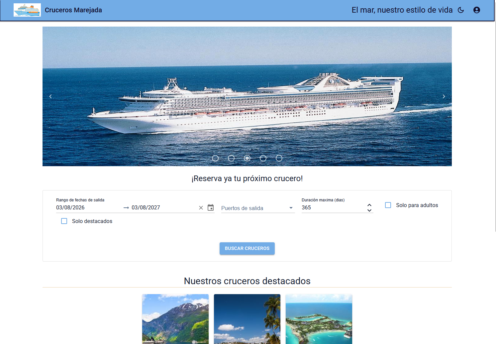
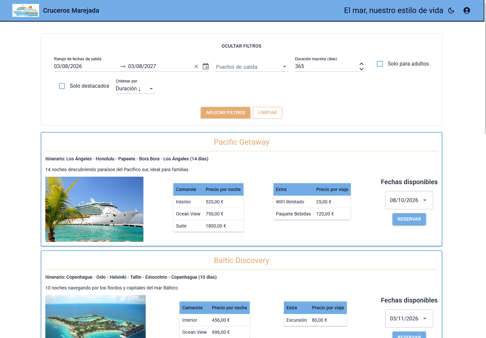
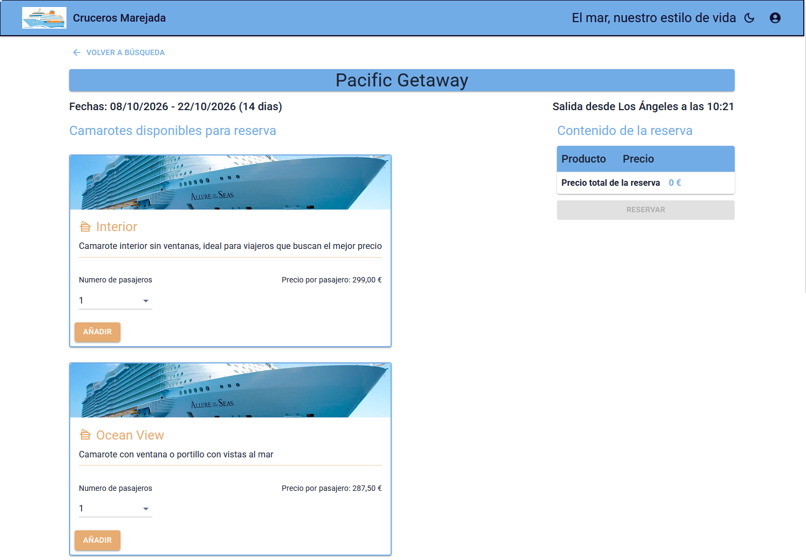
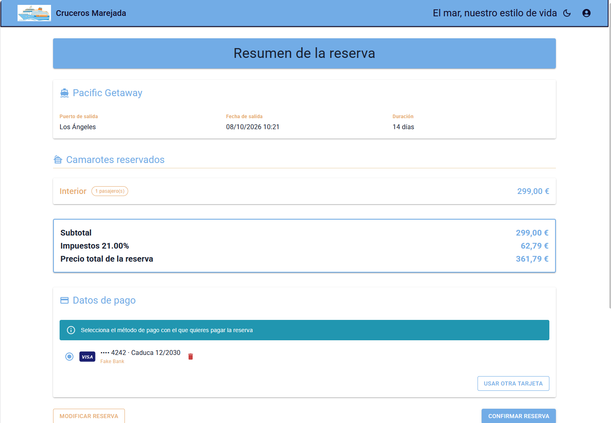
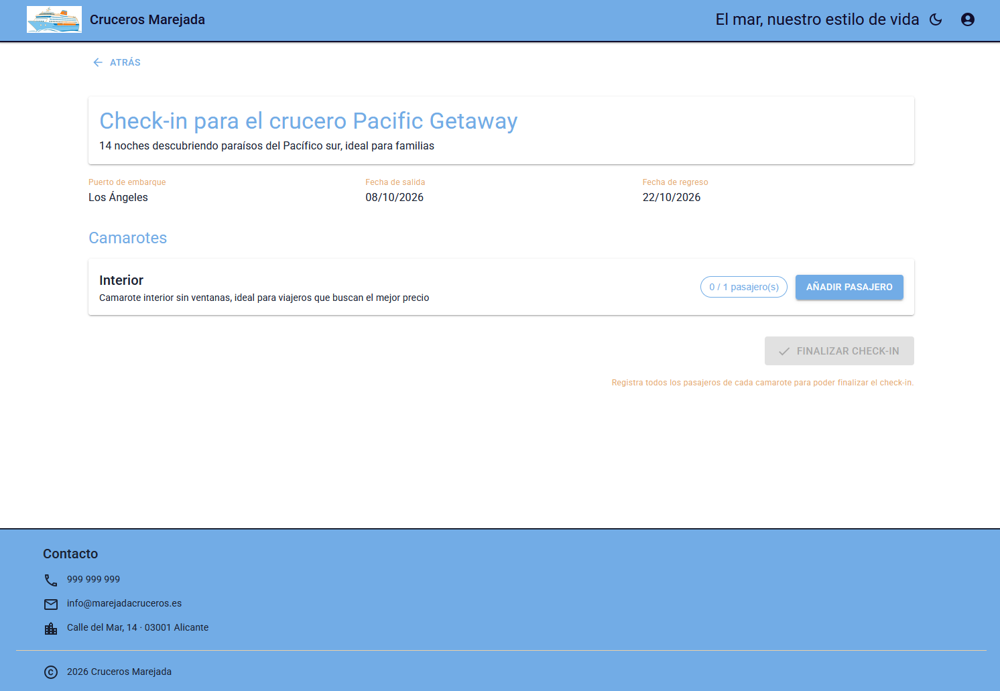
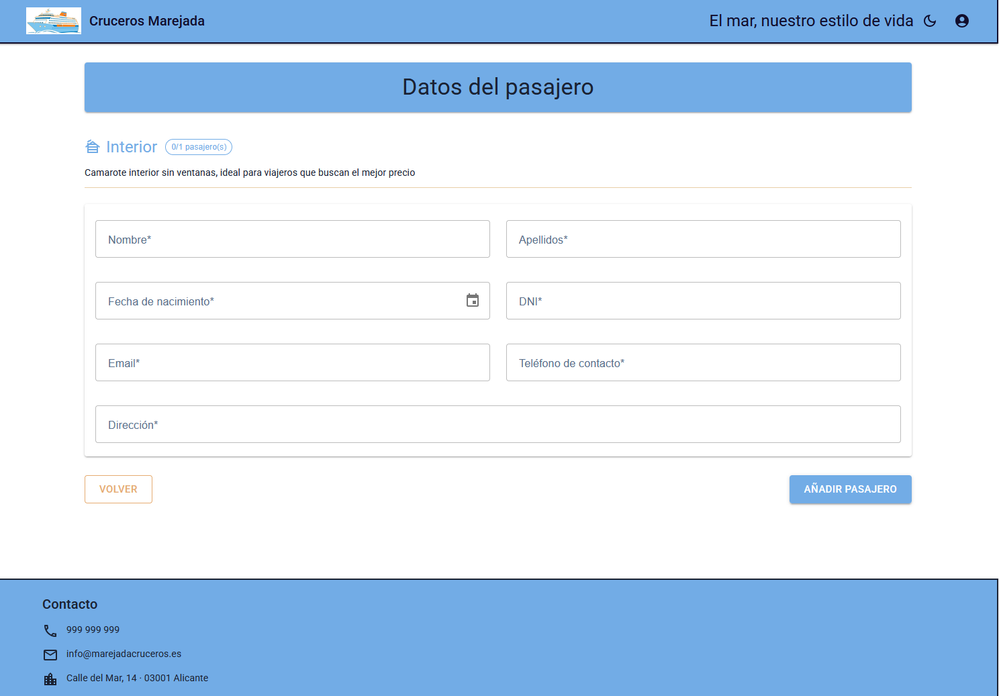
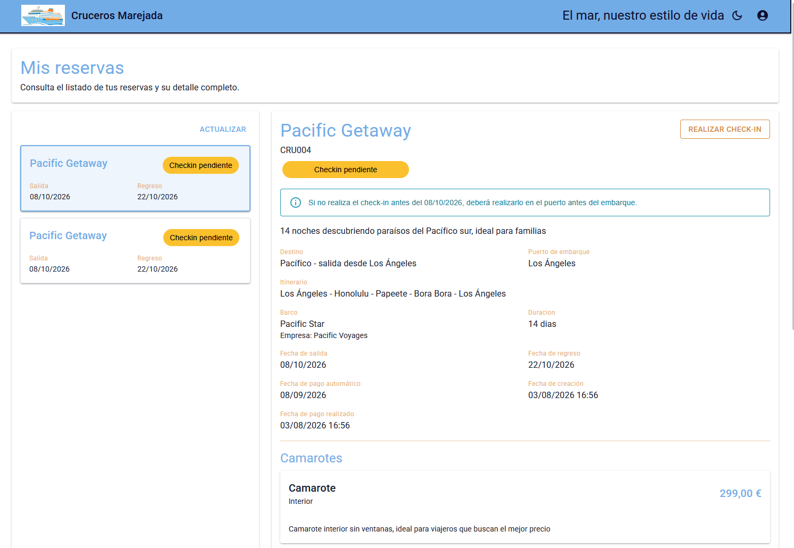
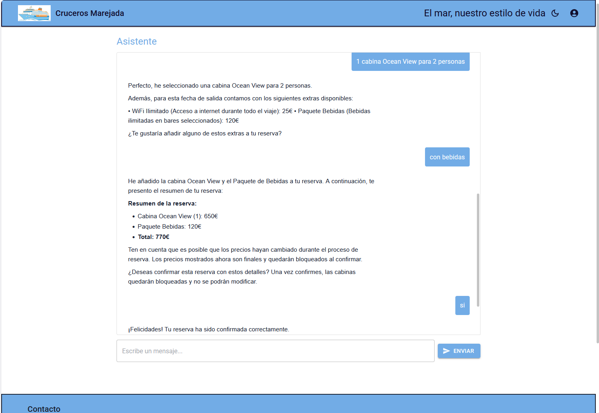
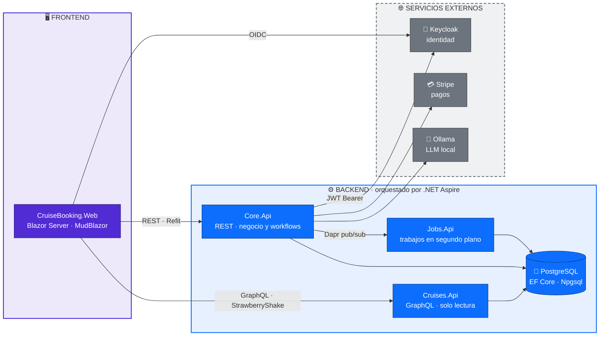
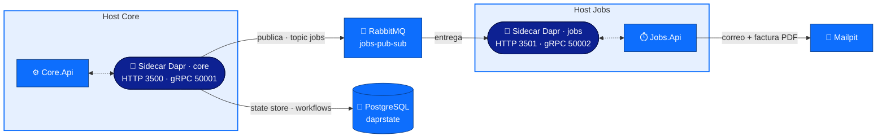

# 🚢 CruiseBooking

[](https://dotnet.microsoft.com/)
[](https://learn.microsoft.com/dotnet/csharp/)
[](https://dotnet.microsoft.com/apps/aspnet/web-apps/blazor)
[](https://learn.microsoft.com/dotnet/aspire/)
[](https://www.postgresql.org/)
[](https://dapr.io/)
[](https://www.rabbitmq.com/)
[](https://chillicream.com/docs/hotchocolate)
[](https://www.keycloak.org/)
[](https://stripe.com/)
[](https://ollama.com/)

Plataforma de reserva de cruceros construida de extremo a extremo sobre **.NET 10**: backend distribuido, frontend Blazor Server y orquestación con .NET Aspire. Se trata de un proyecto de aprendizaje creado manualmente, usando la IA como apoyo para dudas o tareas repetitivas.

El proyecto incluye búsqueda de cruceros, reserva de camarotes y extras, cálculo de impuestos y cobro con Stripe, facturación en PDF por correo, check-in de pasajeros y asistente de IA que orienta al usuario para realizar reservas. Por debajo: Clean Architecture en tres hosts acotados, CQRS a nivel de transporte (lecturas por GraphQL, escrituras por REST), mediador propio sin MediatR, workflows con Dapr y background jobs con Dapr.

---

## 📸 Capturas

| Portada | Búsqueda de cruceros |
| :---: | :---: |
|  |  |
| **Selección de camarotes** | **Resumen y pago** |
|  |  |
| **Check-in · resumen** | **Check-in · datos del pasajero** |
|  |  |
| **Mis reservas** | **Asistente IA** |
|  |  |

---

## 🏗 Arquitectura

### Vista general



### Trabajo en segundo plano con Dapr

Cada host lleva su propio *sidecar* de Dapr; toda la comunicación asíncrona pasa por ellos, nunca directamente entre APIs.



| Host | Responsabilidad |
| --- | --- |
| `Core.Api` | Negocio: reservas, camarotes, pagos, check-in, chat. REST + workflows. |
| `Cruises.Api` | GraphQL de solo lectura sobre el catálogo. |
| `Jobs.Api` | Correos, facturas PDF y limpieza de bloqueos de camarote. |
| `CruiseBooking.Web` | Interfaz web Blazor Server. |

---

## 🧰 Tecnologías y componentes

| Tecnología | Versión | Para qué se usa |
| --- | --- | --- |
| **.NET / C#** | `net10.0` / C# 14 | Runtime único de backend, jobs y frontend. |
| **.NET Aspire** | `13.4.6` | Orquesta contenedores y hosts en local; dashboard y telemetría. |
| **ASP.NET Core Minimal APIs** | `10.0` | Host de la API REST. |
| **Carter** | `10.0.0` | Modulariza los endpoints por área de negocio. |
| **Scrutor** | `7.0.0` | Registra por ensamblado los handlers del mediador CQRS propio. |
| **OpenAPI + Scalar** | `2.7.6` / `2.16.15` | Documentación interactiva de la API. |
| **HotChocolate** | `15.1.16` | Servidor GraphQL: filtros, ordenación, proyecciones y paginación por cursor. |
| **StrawberryShake** | `15.1.12` | Cliente GraphQL tipado generado en compilación para Blazor. |
| **PostgreSQL + Npgsql/EF Core** | `10.0.3` / `10.0.4` | Persistencia, migraciones automáticas al arrancar y `DbSeeder`. |
| **Dapr** (`AspNetCore`, `Client`, `Workflow`, `Jobs`) | `1.18.4` | Pub/sub, `BookingWorkflow` con actividades y jobs programados. |
| **RabbitMQ** | `7.2.1` | Transporte del pub/sub entre `Core.Api` y `Jobs.Api` (topic `jobs`). |
| **Keycloak** | contenedor | Proveedor de identidad; realm `cruises`, cliente `cruises-ui`. |
| **JwtBearer / OpenIdConnect** | `10.0.10` | Validación de JWT en la API y flujo OIDC + cookies en la web. |
| **Stripe.net + Stripe.js** | `52.1.1` | Métodos de pago, `SetupIntent`, cobros, reembolsos e impuestos por dirección fiscal. |
| **Ollama** (`OllamaSharp`) | `5.4.27` | LLM local con *tools* que consultan el catálogo; respuestas en streaming SSE. |
| **Markdig** | `1.3.2` | Renderiza en Markdown las respuestas del asistente. |
| **Blazor Server + MudBlazor** | `8.15.0` | Interfaz interactiva por circuito SignalR, con temas claro/oscuro propios. |
| **Refit** | `13.1.0` | Cliente REST tipado tras la fachada `IBookingApiService`/`ApiResult`. |
| **FluentValidation** | `12.1.1` | Validación de formularios integrada con MudBlazor. |
| **PDFsharp-MigraDoc** | `6.2.4` | Genera las facturas en PDF. |
| **MailKit + Mailpit** | `4.17.0` | Envío SMTP de correos y buzón de desarrollo que los captura. |

---

## ✨ Funcionalidades

- 🔎 **Catálogo y búsqueda** — filtrado, ordenación y paginación por cursor sobre GraphQL; cruceros destacados en portada.
- 🛏️ **Selección de camarotes con bloqueo temporal** — los camarotes elegidos se reservan durante un tiempo limitado y un job programado libera los bloqueos caducados.
- 🎁 **Extras por fecha de crucero** — complementos seleccionables por reserva.
- 🧾 **Precios congelados** — la reserva guarda las líneas netas, el tipo impositivo y el importe bruto; los cobros posteriores leen esos valores y nunca recalculan.
- 💳 **Pagos con Stripe** — métodos de pago guardados, confirmación de `SetupIntent` en el navegador, cobro diferido y reembolsos.
- 🧮 **Impuestos reales** — el tipo impositivo se obtiene de Stripe según la dirección fiscal del cliente, no de configuración.
- 🔄 **Workflow de reserva con Dapr** — `BookingWorkflow` y sus actividades coordinan la confirmación de la reserva.
- 📧 **Facturación automática** — factura en PDF generada con PDFsharp y enviada por correo desde el host de jobs. Se puede ver un ejemplo en [docs/example-invoice.pdf](docs/example-invoice.pdf).
- 🎫 **Check-in de pasajeros** — dos vías: enlace público con token (sin login) o desde una reserva autenticada, ambas sobre el mismo componente compartido.
- 🤖 **Asistente de IA** — chat en streaming con un LLM local de Ollama que dispone de *tools* para consultar el catálogo real y realizar reservas.
- 📚 **Mis reservas** — historial, detalle, pago manual pendiente y cancelación.
- 🔐 **Autenticación federada** — inicio de sesión OIDC contra Keycloak, con alta automática del usuario local y su cliente de Stripe en el primer acceso.

---

## 🚀 Puesta en marcha

**Prerrequisitos:** .NET 10 SDK · Podman Desktop · Aspire CLI · Dapr CLI (`dapr init`) · Ollama con el modelo descargado.

### 1. Keycloak

Keycloak **no lo gestiona Aspire**: hay que levantarlo aparte. El contenedor se arranca en modo desarrollo montando la carpeta `keycloak/` del AppHost como directorio de importación, de forma que el realm `cruises` (`realm-export.json`) queda importado al iniciar.

```bash
podman run --name keycloak-local -p 8080:8080 \
  -e KC_BOOTSTRAP_ADMIN_USERNAME=admin -e KC_BOOTSTRAP_ADMIN_PASSWORD=admin \
  -v ./CruiseBooking.Backend/aspire/AppHost/keycloak:/opt/keycloak/data/import \
  quay.io/keycloak/keycloak:26.6.4 start-dev --import-realm
```

Consola de administración en `http://localhost:8080` con `admin` / `admin`. Si el realm no aparece, impórtalo a mano: **Create realm → Browse → `aspire/AppHost/keycloak/realm-export.json` → Create**. En arranques posteriores basta con `podman start keycloak-local`.

### 2. Dapr

Los sidecars los levanta Aspire, pero el runtime de Dapr tiene que estar inicializado en la máquina. Primero se instala la CLI:

```bash
# Windows
winget install Dapr.CLI

# macOS
brew install dapr/tap/dapr-cli

# Linux
wget -q https://raw.githubusercontent.com/dapr/cli/master/install/install.sh -O - | /bin/bash
```

Después se inicializa el runtime indicando **Podman** como motor de contenedores:

```bash
dapr init --container-runtime podman

# Comprobar la instalación
dapr --version
```

`dapr init` descarga los binarios del runtime y arranca los contenedores de soporte (`dapr_placement`, `dapr_scheduler`). Redis y Zipkin se instalan por defecto, pero no son necesarios y pueden borrarse.

### 3. Stripe

Por defecto los pagos de Stripe estarán desactivados y se usara un servicio local de mockup para toda la funcionalidad de pagos. Esto se controla mediante la clave `Stripe:Enabled`. Si se activa la integración será necesario configurar los secretos como se indica en el siguiente apartado.

### 4. Secretos

```bash
cd CruiseBooking.Backend/src/Core/Api
dotnet user-secrets set "Stripe:SecretKey" "sk_test_..."
dotnet user-secrets set "Stripe:PublishableKey" "pk_test_..."
cd ../../../../CruiseBooking.Web/src
dotnet user-secrets set "Keycloak:ClientSecret" "..."
```

### 5. Arrancar proyectos

```bash
# Backend completo (Postgres, pgAdmin, RabbitMQ, Mailpit, sidecars Dapr y los 3 hosts)
dotnet run --project CruiseBooking.Backend/aspire/AppHost/AppHost.csproj

# Frontend
dotnet run --project CruiseBooking.Web/src/CruiseBooking.csproj
```

**URLs:** web `https://localhost:7251` · REST `http://127.0.0.1:5095/api` · Scalar `/scalar` · GraphQL `http://127.0.0.1:5090/graphql` · Keycloak `:8080` · pgAdmin `:5050` · RabbitMQ `:5672`.

> ⚠️ La URL de codegen (`GraphQL/.graphqlrc.json`) es independiente de la de ejecución (`DataApi:Url`): siempre deben actualizarse juntas.

> ⚠️ Los contenedores externos de `keycloak-local`, `dapr_placement` y `dapr_scheduler` deben arrancarse manualmente antes de lanzar el proyecto de backend.

---

## 📁 Estructura

```
CruiseBooking/
├── CruiseBooking.Backend/
│   ├── src/
│   │   ├── Shared/
│   │   │   ├── Domain/           # Entidades, enums e interfaces de repositorio y servicio
│   │   │   └── Persistence/      # CruisesDbContext, configuradores, repositorios, migraciones, DbSeeder
│   │   ├── Core/
│   │   │   ├── Application/      # Casos de uso CQRS + mediador propio
│   │   │   ├── Infraestructure/  # Workflows Dapr, Stripe, jobs, chat IA
│   │   │   └── Api/              # Endpoints Carter, auth Keycloak, OpenAPI/Scalar, componentes Dapr
│   │   ├── Cruises/
│   │   │   └── Api/              # Host GraphQL (HotChocolate)
│   │   └── Jobs/
│   │       ├── Application/      # Jobs como casos de uso, generación de facturas
│   │       ├── Infrastructure/   # Envío SMTP
│   │       └── Api/              # Host de Dapr Jobs + componentes Dapr
│   ├── aspire/
│   │   ├── AppHost/              # Orquestación de contenedores y hosts; realm de Keycloak
│   │   └── ServiceDefaults/      # OpenTelemetry, health checks, service discovery, resiliencia
│   └── CruiseBooking.Backend.slnx    # Solución del backend (Shared, Core, Cruises, Jobs y Aspire)
│
└── CruiseBooking.Web/
    ├── src/
    │   ├── Components/
    │   │   ├── Pages/            # Páginas Blazor (.razor + code-behind .razor.cs)
    │   │   ├── Layout/           # MainLayout con temas MudBlazor, ReconnectModal
    │   │   └── Shared/           # PaymentMethodSelector, CardBrandIcon
    │   ├── Endpoints/            # Minimal APIs de autenticación (/login, /login-callback, /logout)
    │   ├── GraphQL/              # schema.graphql, queries y configuración de StrawberryShake
    │   ├── Integrations/         # Interfaces Refit (IBookingApi, IChatApi) y AuthHeaderHandler
    │   ├── Mappings/             # Mapeo manual de tipos generados a DTOs
    │   ├── Services/             # Estado de la reserva y del token; fachada IBookingApiService/ApiResult
    │   ├── Vms/                  # ViewModels compartidos entre páginas
    │   └── wwwroot/              # CSS, imágenes e interop de Stripe
    └── CruiseBooking.slnx            # Solución del frontend Blazor Server
```
